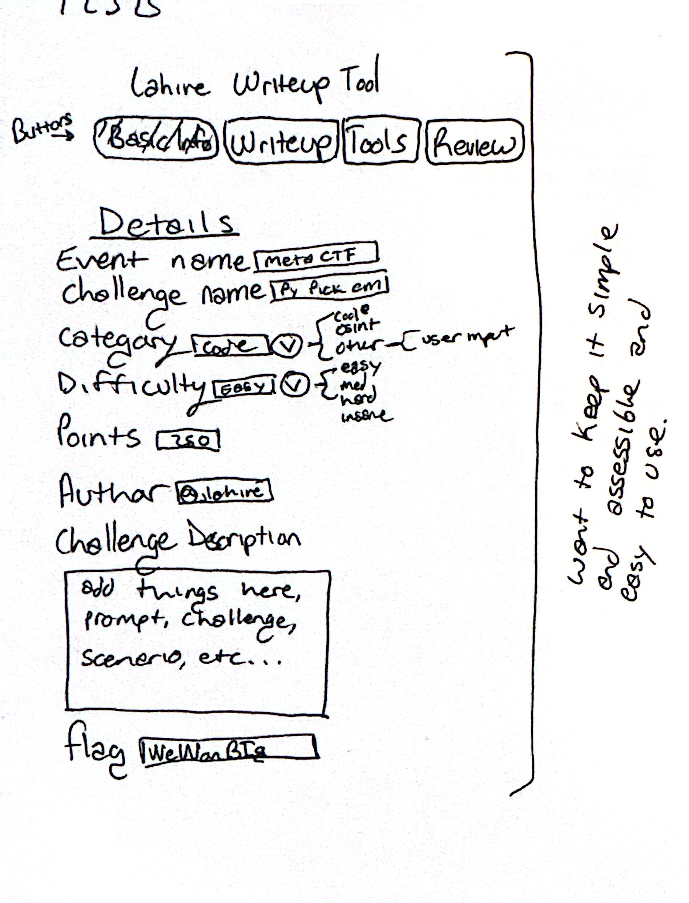
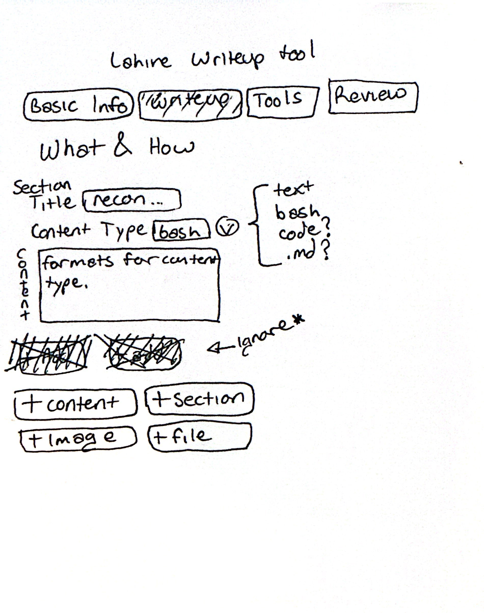
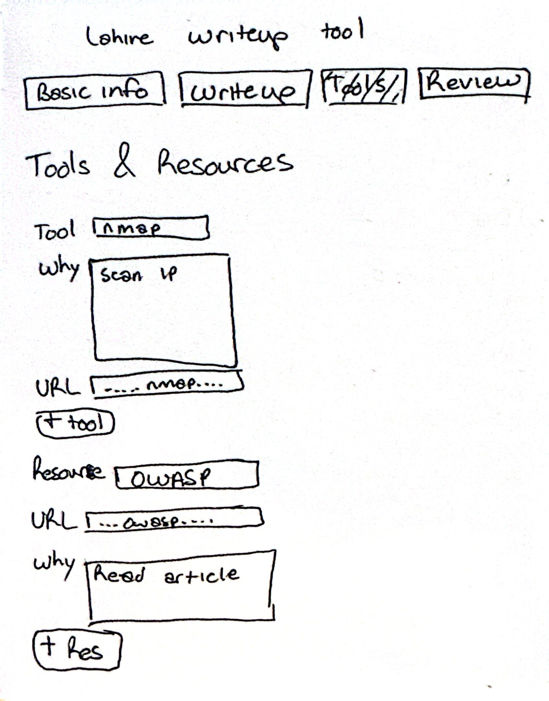
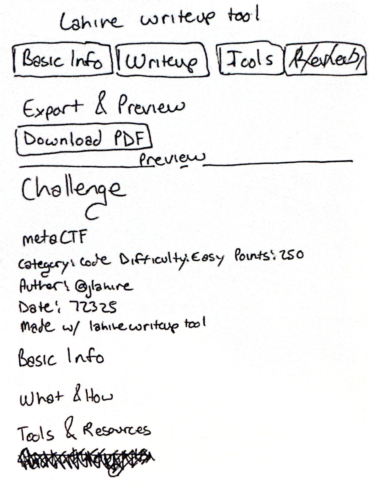

# Lahire CTF Writeup Tool

The primary purpose of this project is to create a writeup web app I can use anywhere and on any device to keep track of CTF progress and easily share my successes and failures with others. The secondary purpose is to showcase taking an idea and building it.

## Design

<h4>Basic Info</h4>
<br>

<h4>Writeup</h4>
<br>

<h4>Tools</h4>
<br>

<h4>Review</h4>
<br>

## DevLog

<h4>Data Collection + Persistence</h4>
<br>

<h4>Writeup add sections + delete</h4>
<br>

## Files
```text
|-- README.md
|-- assets
|   |-- examples
|   |   `-- input_log_persistence.gif
|   `-- wireframe
|       |-- 1.jpg
|       |-- 2.jpg
|       |-- 3.jpg
|       `-- 4.jpg
`-- index.html

3 directories, 7 files
```
